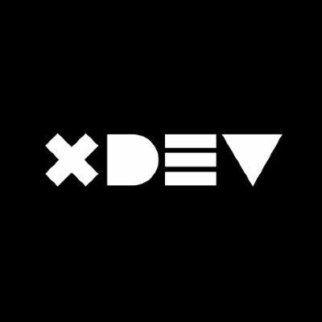

# XPOWDER - POO de Proteinas

Esta es una aplicación de consola para crear y mostrar proteínas utilizando el paradigma de la programación orientada a objetos (POO). Permite al usuario ingresar el nombre, la cantidad de aminoácidos, la presencia de carbohidratos y el sabor de la proteína. El usuario puede crear múltiples proteínas y luego mostrar la lista de las proteínas creadas.

- La clase principal XpowderPOO contiene el método main donde se ejecuta la lógica de la aplicación.

- La clase Protein representa el modelo de una proteína con sus atributos y métodos getter y setter.
## Demo
    1. Ingrese el nombre de la proteína: Whey Protein 
    2. Ingrese la cantidad de aminoácidos: 100.5 
    3. ¿Contiene carbohidratos? (si/no): si 
    4. Ingrese el sabor de la proteína: Chocolate 
* ### Proteína creada exitosamente. 

    5. ¿Desea crear otra proteína? (si/no): no 

## Lista de proteínas creadas: 
* Nombre: Whey Protein 
* Aminoácidos: 100.5 
* Carbohidratos: true 
* Sabor: Chocolate
## Authors

- [@jordonez19](https://github.com/jordonez19/Xpowder-j.git)

## License

### [MIT]

- Derechos de autor: XaviDev "jordonez19" 2023 XPOWDER

Se concede permiso, de forma gratuita, a cualquier persona que obtenga una copia de este software y de los archivos de documentación asociados (el "Software"), para utilizar el Software sin restricciones, incluyendo, sin limitación, los derechos de uso, copia, modificación, fusión, publicación, distribución, sublicencia y/o venta de copias del Software, y para permitir a las personas a quienes se les proporcione el Software hacer lo mismo, sujeto a las siguientes condiciones:

El aviso de copyright anterior y este aviso de permiso se incluirán en todas las copias o partes sustanciales del Software.

EL SOFTWARE SE PROPORCIONA "TAL CUAL", SIN GARANTÍA DE NINGÚN TIPO, EXPRESA O IMPLÍCITA, INCLUYENDO, PERO NO LIMITADA A, LAS GARANTÍAS DE COMERCIABILIDAD, IDONEIDAD PARA UN PROPÓSITO PARTICULAR Y NO INFRACCIÓN. EN NINGÚN CASO, LOS AUTORES O TITULARES DEL COPYRIGHT SERÁN RESPONSABLES DE NINGUNA RECLAMACIÓN, DAÑOS U OTRAS RESPONSABILIDADES, YA SEA EN UNA ACCIÓN DE CONTRATO, AGRAVIO O CUALQUIER OTRO MOTIVO, QUE SURJA DE O EN CONEXIÓN CON EL SOFTWARE O EL USO U OTRO TIPO DE ACCIONES EN EL SOFTWARE.

